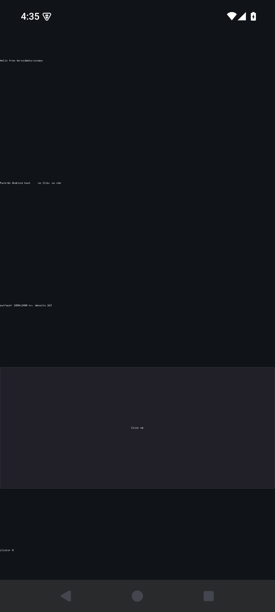

# go-widgets/android

[](https://github.com/go-widgets/android/actions/workflows/ci.yml)
[](https://pkg.go.dev/github.com/go-widgets/android)
[](https://goreportcard.com/report/github.com/go-widgets/android)
[](#testing)
[](LICENSE)

A **pure-Go, CGO-free** Android back-end for the
[go-widgets](https://github.com/go-widgets) toolkit: a real, installable
Android app whose entire user interface is laid out and painted by a Go
process built with `CGO_ENABLED=0`.



## Why it is split in two

Android hands no drawable surface to a process that is not the app. Every path
to one — `ANativeWindow`, `Surface`, `NativeActivity` — is behind JNI, and JNI
needs cgo. `purego` does not rescue it either: its `dlfcn_android.go` routes
`Dlopen` through `internal/cgo`, unlike its darwin and non-cgo linux paths. And
there is no wire-protocol back door the way X11 and Wayland have one:
SurfaceFlinger sits behind Binder, and a `Surface` only ever comes from the
WindowManager against an Activity token.

So the app is two processes:

| | |
|---|---|
| **Java host** (`host/`, ~360 lines) | owns the Activity, the `SurfaceView`, touch, keys and the lifecycle. Blits pixels. Knows nothing about widgets. |
| **Go application** (`cmd/gwapp`) | an ordinary `CGO_ENABLED=0 GOOS=android` executable. Owns layout, widgets, theme, hit-testing and focus — unchanged from every other back-end. |

This is the split the Linux back-ends already live with — a socket protocol
plus a shared pixel buffer — with the Java host standing exactly where the X
server or the Wayland compositor stands.

```
  MotionEvent ─► LocalSocket ─► android.Client ─► toolkit widget tree
                                      │
  Surface ◄── Bitmap ◄── mmap'd file ◄─┘  painter.PixelPainter
                    ▲
                    └── MsgFrame{x,y,w,h}: which rectangle changed
```

Pixels travel through a file in the app's own storage that both processes map.
The Go side writes RGBA_8888, which is byte-for-byte what Android's ARGB_8888
`Bitmap` holds in memory, so the blit is a copy with no conversion.

## arm64 only, and why

`android/arm64` is the only Android target Go links **CGO-free**:

```console
$ CGO_ENABLED=0 GOOS=android GOARCH=arm64 go build ./cmd/gwapp   # fine
$ CGO_ENABLED=0 GOOS=android GOARCH=arm   go build ./cmd/gwapp
android/arm requires external (cgo) linking, but cgo is not enabled
```

`android/amd64` and `android/386` answer the same. So the premise this back-end
rests on — a sovereign application binary with no C tool chain — holds on
64-bit ARM alone, which is every Android phone and tablet shipped for years,
but not the x86 emulator images. CI asserts both halves of that, so the day Go
lifts the restriction is a red build rather than a silent one.

## Usage

```go
c, err := android.Dial("my app", nil) // nil theme = toolkit.DefaultDark()
if errors.Is(err, android.ErrUnsupported) {
    // Not running under a host: the module still builds and vets everywhere.
    return nil
}
defer c.Close()
return c.Run(myWidgetTree()) // blocks until the Activity goes away
```

`Client` satisfies go-widgets/window's `Backend` (`Run`/`Close`/`Size`/
`String`) and its `Repainter`, so an application moves between this back-end
and X11, Wayland, Cocoa, Win32 or wasmbox without changing a line above the
window.

## Layout

    protocol.go       the sovereign codec — wire messages, framing, and the
                      input→toolkit.Event mapping. No syscall, no net: it
                      builds, and is tested, on every GOOS.
    client.go         the transport — dials the host, maps the framebuffer,
                      drives the widget tree. //go:build linux
    client_other.go   the same surface reporting ErrUnsupported, so an
                      application still cross-builds off Android.
    cmd/gwapp/        the demo application.
    host/             the Java host, its manifest, and build.sh.

## Building the APK

No Gradle and no Kotlin: the host is a handful of Java files and the
application is a Go binary, so the SDK's own tools are the whole tool chain.

```sh
export ANDROID_HOME=... JAVA_HOME=...
sdkmanager --install "platforms;android-35" "build-tools;35.0.0"
host/build.sh                        # → host/out/gwhost.apk
adb install host/out/gwhost.apk
```

`build.sh` runs `go build`, `javac`, `d8`, `aapt2 link`, `zipalign` and
`apksigner`, in that order, and picks the newest platform and build-tools the
SDK has installed. Two things it does that are worth knowing:

- the Go executable ships as `lib/<abi>/libgwapp.so` with
  `extractNativeLibs="true"`, because `nativeLibraryDir` is the one place an
  Android app may execute from. It is a plain PIE executable; nothing ever
  `dlopen`s it;
- the debug keystore lives beside the sources, never under the build output. A
  fresh key per build changes the signing certificate, and Android then refuses
  to update an installed app (`INSTALL_FAILED_UPDATE_INCOMPATIBLE`).

## Testing

The transport is Linux, and Android *is* Linux: the abstract socket it dials
and the shared mapping it paints into are ordinary Linux facilities. So the
suite runs against a **fake host over a real socket and a real mmap**, not a
mock — on the CI Linux runner under `-race`, and on the device itself:

```sh
go test -c -cover -coverpkg=. -o android.test .
adb push android.test /data/local/tmp/ && adb shell /data/local/tmp/android.test
```

`100.0%` statement coverage, gated in CI, covering every decode error, every
framebuffer failure, the lifecycle pause and the damage-rectangle path.
`-race` runs on the Linux lane only: the race detector needs cgo, which is the
very thing an Android application binary must not have.

## Proven on device

Android 15 / arm64:

- the app installs and launches; the whole window is the go-widgets tree;
- a touch reaches the widget — three taps on the button leave `clicks: 3`, and
  a pixel diff bounds the repaint to the button and its label alone;
- a live rotation is survived in-process: the Activity keeps `configChanges`,
  the surface is remapped at 2400×1080, the tree is laid out again, and taps
  still land ([landscape](docs/apk-landscape.png));
- the surface geometry and display density cross the socket — the demo reports
  `surface: 1080x2400 px, density 263`, the panel's true 2.625×.

## Known gaps

Deliberate, and none of them protocol-deep:

- **whole-buffer copy per frame** — `copyPixelsFromBuffer` copies the whole
  surface even when the damage is one button. The rectangle already crosses the
  wire; the host should honour it;
- **file-backed mapping** — simple, and it made both sides trivial, but a
  file-backed `MAP_SHARED` page is writeback-eligible. The upgrade is a memfd
  passed as an ancillary descriptor over the `LocalSocket`;
- **single touch** — the protocol carries a pointer id, the host forwards one.
  Multi-touch, fling and inertial scroll are toolkit work, not host work;
- **no IME** — a soft keyboard needs `InputConnection` on the host and a text
  model above;
- **no accessibility** — the host can expose an `AccessibilityNodeProvider` fed
  by the same tree the AT-SPI, UIA and NSAccessibility bridges already walk;
- **no insets** — the window is edge-to-edge from API 35, so the system bars
  are drawn over the surface.

## License

BSD-3-Clause. See [LICENSE](LICENSE).
